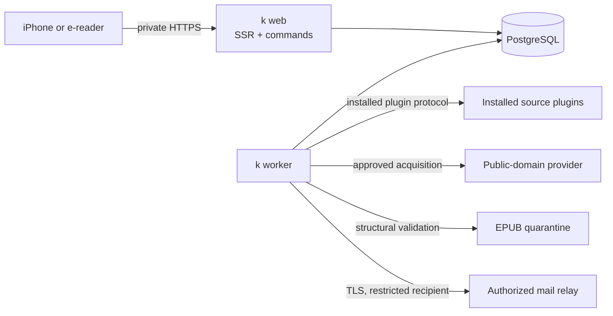

# Architecture

## User-visible outcome

After the first complete slice, Member 1, Member 2, or Member 3 can unlock `k` on
the private household network, search operator-installed public-domain sources,
inspect a candidate EPUB, and track it through validation until the mail service
accepts its submission to their configured Kindle address.

## System shape

`k` is a TypeScript modular monolith shipped as one immutable image with three
commands:

- `web`: server-rendered HTML, same-origin HTTP endpoints, sessions, search,
  preflight, and operation reads;
- `worker`: claims durable operations and performs plugin acquisition, EPUB
  validation, and email submission;
- `migrate`: applies ordered PostgreSQL migrations under an advisory lock.

The web process never invokes a browser or email transport. The worker is the only
process permitted to acquire book bytes or submit email. Both processes
share PostgreSQL, but modules own their tables and expose application ports rather
than relying on cross-module SQL.

## Bounded contexts

| Context | Owns | Does not own |
|---|---|---|
| Identity | Fixed profiles, PIN verifiers, throttles, sessions, reauthentication | Public account registration, social login |
| Provider accounts | Profile-owned OAuth transactions, encrypted grants, refresh/revocation, masked account state | Creating profiles, unlocking `k`, plugin installation |
| Catalog | Installed-plugin fan-out, normalization, cache, provenance, partial results | Acquisition or file storage |
| Integrations | Installed plugin manifests, process protocol, capability descriptors | Remote installation or arbitrary plug-in code |
| Acquisition | Opaque acquisition options, approved targets, artifact streaming | Caller-supplied URLs or browser recipes |
| Publication | Quarantine inspection and bounded EPUB structural validation | Provider selection or email |
| Delivery | Phase 3 Kindle/SMTP; Phase 4 target OneDrive destinations and generalized sender readiness | Claiming device receipt or sync |
| Operations | Preflights, idempotency, leases, stages, retries, cancellation | Domain-specific parsing |
| Audit | Immutable security and operation evidence | Secrets or full file contents |

## HTTP and SSR boundary

OpenAPI 3.1 in `contracts/http.openapi.yaml` is the UI/backend handshake. SSR
loaders call the same application services as HTTP handlers; they do not make
loopback requests. Mutations use POST/PATCH/DELETE with CSRF and Origin checks.
The core flow works without JavaScript. Progressive enhancement may poll operation
status, but every state has an ordinary HTML refresh path.

The server-rendered route contract is:

| Route | Method | Purpose | No-JS result |
|---|---|---|---|
| `/` | GET | Choose the current start page | `303` to Search or Unlock |
| `/unlock` | GET/POST | Select a fixed profile and submit its PIN | Inline error/delay or `303 /search` |
| `/setup` | GET/POST | Redeem an operator-issued credential code and set a PIN | Inline validation or `303 /unlock` |
| `/search` | GET | Search using query parameter `q` | Complete result list in HTML |
| `/books/:catalogRef` | GET | Show edition, source, and capability evidence | Information page; no mutation |
| `/delivery/preflight` | POST | Create a non-mutating delivery preflight | Review page with blockers and warnings |
| `/operations` | POST | Submit an idempotent operation | `303 /activity/:operationId` |
| `/activity` | GET | List profile-owned operations | HTML list with a Refresh link |
| `/activity/:operationId` | GET/POST | Show detail; POST cancel or receipt confirmation | Current stage evidence and receipt |
| `/profile` | GET/POST | Show or mutate destination/PIN after recent verification | Inline validation and `303` on success |
| `/profile/integrations/:connector` | POST | Start a profile-owned provider connection after recent PIN | `303` to a fixed provider authorization endpoint |
| `/oauth/callback/:connector` | GET | Validate and consume one provider authorization response | `303` to a fixed local completion page |
| `/profile/integrations/:account/disconnect` | GET | Phase 3 informational impact preview; Phase 4 target adds POST submission | Preview only in Phase 3 |

Every HTML mutation carries the same CSRF value and calls the same command handler
as its JSON counterpart. Forms use Post/Redirect/Get, preserve only safe input after
validation failure, and never put PINs, setup codes, addresses, or provider secrets
in URLs. Operation refresh is an ordinary GET; JavaScript polling is optional.

## Credential lifecycle

Profiles are seeded without default PINs. Initial setup and recovery use a
high-entropy, one-time credential code issued by the operator-only `k admin
credential-code` command. The command accepts only a non-secret profile slug,
purpose (`setup` or `recovery`), and TTL; it generates 32 random bytes internally and
prints the code once. The database stores only a SHA-256 digest, purpose, profile,
credential revision, issuer audit identity, issue/expiry time, and consumption time.
The default TTL is 15 minutes.

Setup-code issuance is allowed only while the profile has no PIN. Recovery-code
issuance is a database transaction that increments the credential revision, marks the
profile `recovery-required`, consumes prior codes, revokes all sessions, disables PIN
login, and appends an audit event before printing the new code. An expired recovery
code does not reactivate the old PIN; the operator must issue a replacement. This
keeps recovery fail-closed when the old PIN may be compromised.

The user enters the code and new PIN in a POST body. The server rate-limits code
redemption, compares the digest in constant time, verifies purpose/profile/revision,
rejects expired or consumed codes, rejects the weak-PIN deny list and any PIN already
used by another profile, and atomically:

1. writes the Argon2id PIN verifier;
2. increments the credential revision;
3. consumes every outstanding code for that profile;
4. revokes every profile session;
5. resets authentication throttle state; and
6. appends a redacted audit event.

Recovery redemption uses the same transition with a `recovery` code and never discloses whether
the code, profile, state, or PIN caused failure. An authenticated profile may change
its PIN by submitting the current and new values; the same validation, revision,
session-revocation, and audit transaction applies. There is no remote "forgot PIN"
flow, default PIN, owner override, or unauthenticated first-visitor claim. Losing
every PIN requires the operator-only recovery command.

## Private request boundary

The web host requires an exact HTTPS public origin, trusted reverse-proxy CIDRs, and
allowed private client CIDRs at startup. Configuration is rejected if an allowed
client range is not private or if the public origin is not HTTPS. Except for
cluster-local probes, middleware rejects traffic unless the immediate peer is a
trusted proxy, the canonical forwarded scheme and host match the configured origin,
and the resolved client address is inside an allowed private range.

The application trusts only the forwarded chain produced by Traefik; it does not
accept caller-appended forwarding headers. Kubernetes NetworkPolicy permits web
ingress only from Traefik, and Traefik applies the same private source ranges.
`/readyz` returns `503` when origin, proxy ranges, client ranges, PIN pepper,
database, or session-key prerequisites are absent or invalid. DNS topology cannot be
proved by the process, so the homelab gate separately verifies there is no public
DNS, Cloudflare Tunnel, or WAN ingress route before cutover.

## Data model

The active physical schema is defined by applied migrations. Items labeled Phase 4
target below are accepted end-state architecture, not current Phase 3 tables or routes.

The first schema contains:

- `profiles`: exactly three deployment-seeded rows, optional Kindle address,
  Argon2id verifier, credential revision;
- `credential_codes`: hashed operator-issued setup/recovery codes with profile,
  purpose, credential revision, expiry, consumption, and issuer audit identity;
- `auth_throttles` and `sessions`: persisted failure windows, lock level, hashed
  opaque session tokens, idle/absolute expiry, revocation;
- `provider_cache`: legacy Phase 2 Open Library cache retained for migration
  compatibility but unused by the Phase 3 runtime;
- `plugin_cache`: digest-bound installed-plugin search/detail responses;
- `provider_accounts` and `oauth_authorizations`: profile-owned masked account state,
  encrypted grants, fixed connector/scopes, grant revision, and ten-minute one-use
  authorization transactions;
- `delivery_destinations` (Phase 4 target): typed Kindle and OneDrive destinations with account/sender
  dependencies and revision;
- `preflights`: five-minute, profile-bound, single-use snapshots of eligibility,
  destination revision, blockers, warnings, and planned stages;
- `operations` and `operation_stages`: idempotency key, lease, stage evidence,
  terminal result, retry/cancel flags;
- `artifacts`: random storage key, media type, byte size, SHA-256, provenance,
  validation, retention state;
- `delivery_attempts`: deterministic Message-ID in Phase 3; operation-owned OneDrive path is a Phase 4 target,
  redacted destination, provider receipt, and ambiguity/reconciliation state;
- `audit_events`: append-only actor/action/target/outcome and correlation IDs.

Migrations follow expand, migrate, contract. A release supports its current schema
and the immediately previous schema. Destructive contraction is a separate,
operator-approved release with a backup and restore drill.

## Operation state machine

Operations use `queued`, `waiting`, `running`, `blocked`, `canceling`, `canceled`,
`succeeded`, `failed`, `partial`, `expired`, or `unknown`. Ordered stages are:

1. `preflight`
2. `acquire`
3. `validate`
4. `metadata`
5. `convert`
6. `validate-output`
7. `deliver`
8. `cleanup`

Workers claim rows with `FOR UPDATE SKIP LOCKED` and an expiring lease. Safe,
idempotent stages may be reclaimed after a stale lease. SMTP is not exactly-once:
the worker writes a `sending` attempt before submission and uses a deterministic
Message-ID. A timeout or crash after possible acceptance becomes
`blocked/DELIVERY_UNKNOWN`; it is never automatically resent.

The `convert` and `validate-output` stages remain in the durable state machine for
contract continuity. Wave 1 sources already provide EPUB, so the worker records
conversion as skipped and performs the same bounded EPUB validation before delivery.

## Provider boundary

Metadata and acquisition are separate plugin capabilities. Public results never carry
an executable source URL. Core discovers reviewed manifests from the operator-owned
deployment directory and treats their presence as active. There is no profile or UI
enablement control. Core checks the plugin digest and capability on every command and
passes only opaque item/option IDs to a bounded child process. The plugin owns source-
specific URLs and writes acquisition bytes only to a random core-created quarantine
path. Core then rechecks the plugin digest, preflight and destination revisions,
byte/hash claims, media type, rights evidence, and EPUB shape.

Phase 3 catalog traffic is entirely plugin-driven. The initial installed plugins are
Project Gutenberg, Standard Ebooks, and rights-filtered Internet Archive. Private OPDS
is a later plugin. Remote plugin installation, arbitrary URL input, and unreviewed
plugin marketplaces are absent.

ADR-0006 adds strict capability manifest/protocol version 2 while preserving every
source-v1 manifest and wire request. Core normalizes v1 source commands internally.
New capability families are catalog source, metadata enricher, identity provider,
mail sender, and delivery destination. A plugin declares media kinds and artifact
types; host support is separate, so a future movie capability remains unsupported
until a signed-off movie rights/file pipeline exists.

Core alone owns OAuth authorization-code transactions, PKCE S256, exact per-issuer
callbacks, encrypted access/refresh tokens, key rotation, refresh serialization, and
Phase 3 identity connections. Durable disconnect operations are a Phase 4 target.
Provider identity is account-connection evidence only and
never unlocks `k`. A plugin invocation receives one short-lived scoped access/API
token through stdin and never receives a refresh token, client secret, encryption
key, `k` session, or arbitrary OAuth/network endpoint.

Google Books contributes sourced metadata/ratings without changing acquisition.
Goodreads is unsupported with no scraping fallback. Amazon Creators availability is
eligibility gated, Login with Amazon is identity-only, and Kindle Unlimited is not
exposed. Phase 4 target semantics keep Gmail provider acceptance and OneDrive provider storage distinct from
Kindle receipt or device sync.

`OUTBOUND_CONTACT` is required so source-plugin requests use an identified
`User-Agent`. Source origins remain manifest-owned; core has no provider base-URL
configuration.

A Playwright transport is deferred until a provider-specific need is approved and
tests prove deny-by-default egress, connect-time private-IP rejection, redirect
revalidation, bounded downloads, and fresh non-persistent browser contexts. It does
not expose a page object, selector language, arbitrary URL, or remote browser API.

## File pipeline

Files are streamed to a quarantine path outside the web root while computing
SHA-256 and enforcing size. Validation checks extension, MIME, magic bytes,
container paths, member count, expanded size, encryption/DRM markers, and the EPUB
structure, including the first uncompressed `mimetype` entry. Wave 1 performs no
format conversion because all installed sources expose EPUB. Calibre and EPUBCheck
remain deferred until a source with a current conversion requirement is approved.

## Deployment ownership

This repository owns application code, image construction, contracts, migrations,
tests, and release artifacts. The `homelab` repository owns Kubernetes manifests,
private routing, DNS/TLS, storage, NetworkPolicy, External Secrets references, and
the deployed image digest. Durable cluster changes use GitOps. No secret values or
live infrastructure state belong in this repository.

## Future application namespace

Future household games may live under `/play/*` and reuse the profile/session
boundary. No game route, navigation, schema, dependency, or placeholder is built in
the book-delivery phases; unknown `/play/*` paths return the normal 404.
